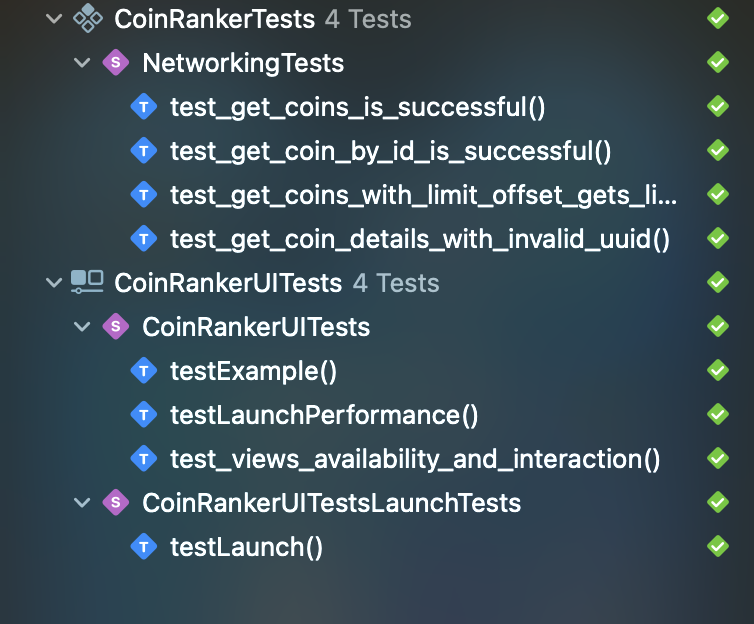

# CoinRanker 

Take Home assessment

CoinRanker is An iOS application that fetches data from the [CoinRanking](https://developers.coinranking.com/api/documentation) API and displays a list of the top 100
cryptocurrency coins paginated, showing 20 characters per page.
Written using SwiftUI and UIKit.


# 📷 Screenshots
#### Features

| Coin List (Light) | Coin List (Dark) | Filter (Light) |
|:------------------:|:------------------:|:------------------:|
|  |  |  |

| Filter (Dark) | List (Light) | List (Dark) |
|:------------------:|:------------------:|:------------------:|
|  |  |  |

| Details (Light) | Details (Dark) | Favorites (Light) | Favorites (Dark) |
|:------------------:|:------------------:|:------------------:|:------------------:|
|  |  |  |  |

| Favorite Action | Unfavorite Action |
|:------------------:|:------------------:|
|  |  |


#### Testing

- Unit tests for Networking service
- UI Integration Tests
- To Test use ⌘U or navigate to Product then Test in Xcode. (Have the ApiKey set up so as not to run into ratelimit issues)

| Tests |
|:----------------:|
|  |


## Features

### Screen 1: Top 100 Coins List

- Displays the **top 100 coins**, paginated (20 coins per page)
- Each coin item shows:
  - Coin icon
  - Coin name
  - Current price
  - 24-hour performance
- Includes filtering options:
  - Sort by highest price
  - Sort by best 24-hour performance
- Swipe left to favorite or unfavorite a coin

---

### Screen 2: Coin Details View

- Displays full coin name
- Interactive performance chart with selectable time filters
- Current price
- Additional statistics (market cap, volume, etc.)

---

### Screen 3: Favorites Screen

- View a list of all favorited coins
- Tap any coin to view full details
- Swipe to unfavorite directly from the favorites list

---

### Implementation Notes

- **UIKit**: Used for the main coin list, including the table header view
- **SwiftUI**: Used for individual coin items and the coin details view (including the chart)


## 🚀 Getting Started

Clone project and in the `Info.plist`, add the Api key

```
<key>COIN_API_KEY</key>
<string>Api key here</string>
```
You can generate a free API_KEY [Here](https://developers.coinranking.com/api/documentation) if you don't have one

You're are good to go 🥳 Build to run

### Dislaimer
```
You still can run the app without an APIKEY but...
The unauthenticated requests are not guaranteed to work, so we advise you to get a key to not unexpectedly run into the rate limiter.
The rate limiter might also affect the success of the tests so It's highly advised to have an APIKey as the CoinRanking Docs state.
```

## TechStack 🛠️
- [Swift](https://developer.apple.com/swift/) - Swift is a powerful and intuitive programming language for all Apple platforms. It’s easy to get started using Swift, with a concise yet expressive syntax and modern features you’ll love. Swift code is safe by design and produces software that runs lightning-fast.
- [SwiftUI](https://developer.apple.com/documentation/swiftui/) - SwiftUI provides views, controls, and layout structures for declaring your app’s user interface. The framework provides event handlers for delivering taps, gestures, and other types of input to your app, and tools to manage the flow of data from your app’s models down to the views and controls that users see and interact with
- [URLSession](https://developer.apple.com/documentation/foundation/urlsession) - Powerful Netwoking tool
- [SwiftCharts](https://developer.apple.com/documentation/charts) - Swift Charts is a powerful and concise SwiftUI framework you can use to transform your data into informative visualizations. 
- [UIKit](https://developer.apple.com/documentation/uikit) - UIKit provides a variety of features for building apps, including components you can use to construct the core infrastructure of your iOS, iPadOS, or tvOS apps. The framework provides the window and view architecture for implementing your UI, the event-handling infrastructure for delivering Multi-Touch and other types of input to your app, and the main run loop for managing interactions between the user, the system, and your app.
- [Combine](https://developer.apple.com/documentation/combine) - The Combine framework provides a declarative Swift API for processing values over time. These values can represent many kinds of asynchronous events
- [SwiftData](https://developer.apple.com/documentation/combine) - SwiftData offers an expressive and lightweight API for modeling and persisting your app's data using pure Swift code

## Challenges && Solutions
1. Due to sometimes hitting the rate limit while using the free apikey/ (when not using the apikey) , I added a view more button incase you haddent fetched all the 10 coins
so once limit is ended you can promt viewMore to view the remaining coins without scrolling up and down to relaunch the pagination


## 👨🏾‍💻 Author

- [Felix-Karuki](https://www.github.com/Felix-Kariuki)

## 📧 Reach Out 

  * [Twitter](https://twitter.com/felixkariuki_)

  * [LinkedIn](https://www.linkedin.com/in/felix-kariuki/)

## License and Copyright ©️ 
[LICENSE](https://github.com/Felix-Kariuki/CoinRanker/blob/main/LICENSE)

```
MIT License

Copyright (c) 2025 Felix Kariuki

Permission is hereby granted, free of charge, to any person obtaining a copy
of this software and associated documentation files (the "Software"), to deal
in the Software without restriction, including without limitation the rights
to use, copy, modify, merge, publish, distribute, sublicense, and/or sell
copies of the Software, and to permit persons to whom the Software is
furnished to do so, subject to the following conditions:

The above copyright notice and this permission notice shall be included in all
copies or substantial portions of the Software.

THE SOFTWARE IS PROVIDED "AS IS", WITHOUT WARRANTY OF ANY KIND, EXPRESS OR
IMPLIED, INCLUDING BUT NOT LIMITED TO THE WARRANTIES OF MERCHANTABILITY,
FITNESS FOR A PARTICULAR PURPOSE AND NONINFRINGEMENT. IN NO EVENT SHALL THE
AUTHORS OR COPYRIGHT HOLDERS BE LIABLE FOR ANY CLAIM, DAMAGES OR OTHER
LIABILITY, WHETHER IN AN ACTION OF CONTRACT, TORT OR OTHERWISE, ARISING FROM,
OUT OF OR IN CONNECTION WITH THE SOFTWARE OR THE USE OR OTHER DEALINGS IN THE
SOFTWARE.

```
